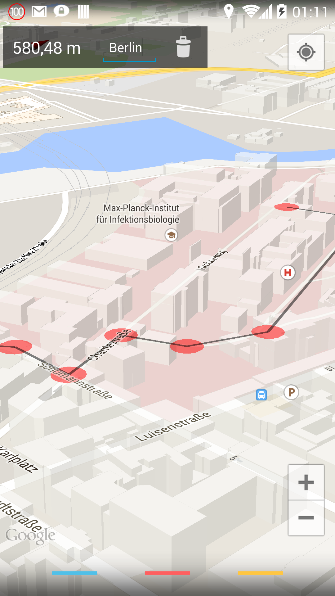
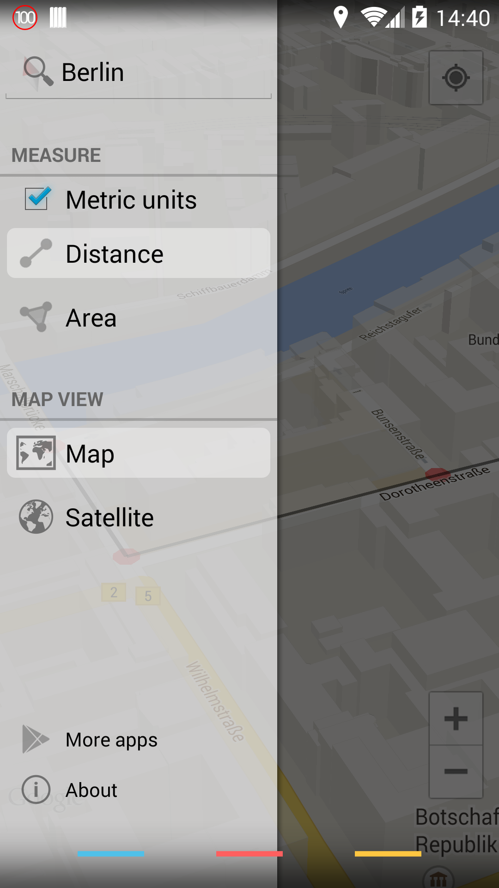

MapsMeasure
===========

A simple app to measure distances on Google Maps.

<table sytle="border: 0px;">
<tr>
<td></td>
<td></td>
</tr>
</table>

Build
-----

To build the app, add the [Google Play Services lib](http://developer.android.com/google/play-services/index.html "Google Play services") to the build path
