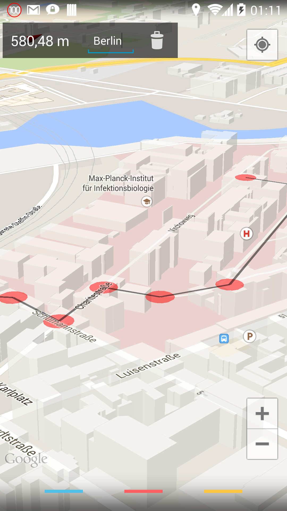
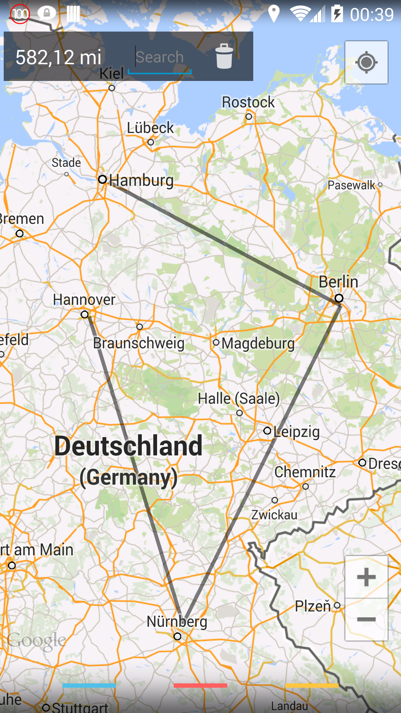

MapsMeasure
===========

A simple app to measure distances on Google Maps.

<table sytle="border: 0px;">
<tr>
<td></td>
<td></td>
<td></td>
</tr>
</table>


Build
-----

Requirements: the Android SDK with platform 37 (point `sdk.dir` in `local.properties` at it, or set
`ANDROID_HOME`). Gradle runs on JDK 21 and downloads one itself if none is installed.

    ./gradlew assembleDebug

### API key

The map needs a Google Maps API key. Without it the app builds and runs, but the map stays blank.
Create `src/main/res/values/maps_key.xml` (it is gitignored):

```xml
<?xml version="1.0" encoding="utf-8"?>
<resources>
    <string name="maps_api_key">YOUR_MAPS_SDK_KEY</string>
</resources>
```

Get the key in the [Google Cloud console](https://developers.google.com/maps/documentation/android-sdk/get-api-key)
and restrict it to the package name `de.j4velin.mapsmeasure` and the SHA-1 of the
certificate you sign with.

### Signing

Both build types are signed with the keystore named in `key.properties`. If that file does not
exist, the build uses `example.keystore.jks` through `key.properties.sample` and also replaces the
API key above with a placeholder. To use your own keys, copy `key.properties.sample` to
`key.properties` and fill in your keystore.
